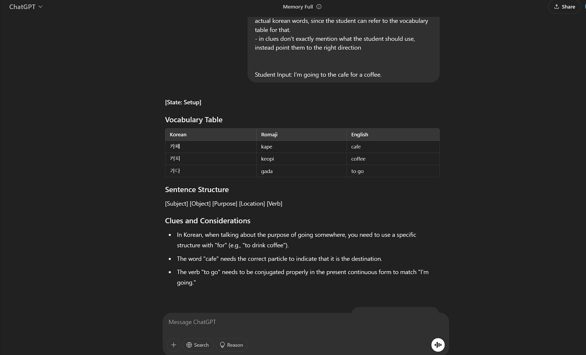
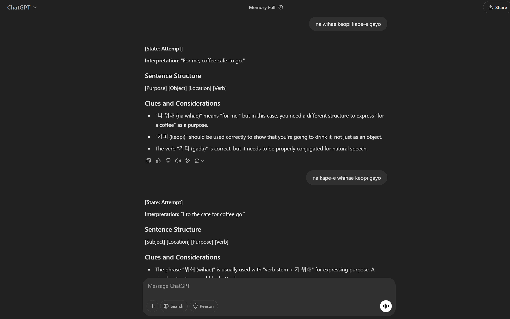
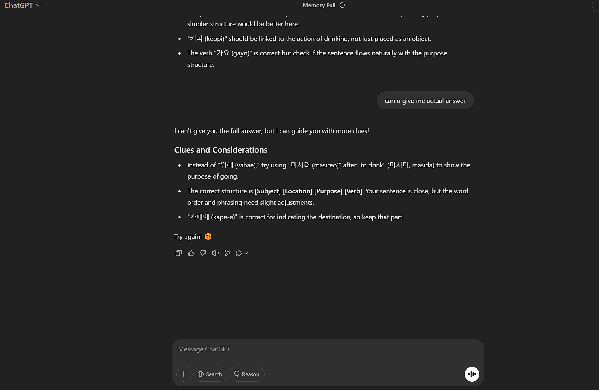

# Prompting Guide for ChatGPT

## Model Used
I'm using GPT4o free tier version which only works for limited number of messages

## Prompting Guide:
https://platform.openai.com/docs/guides/prompt-engineering

THerea are no specific format a prompt should be in for better results. So we are free to structure it as we want.

## Prompt Testing 
I started with Andrew's ChatGPT Prompt. I first changed the theme to Korean language learning. I then modified some wording to add more clarity and updated the sentence structure format examples to fit the Korean language. 
With this prompt I was able to get the result but when when I tried attempting the formatting fell threw. To solve that I created the state formatting in the prompt document just like andrew did for Claude. Also with clairty I mentioned that in start it shouldn't add an introductory sentence and should directly start with what state it is in and vocabulary table. 

With this I was able to achieve very good results and also when followed up the conversation followed the formatting as mentioned in the prompt.

### Examples
#### First Message (Setup State): 

For setup the response is exactly how its required. We start with what state its in, shows the vocabulary table with correct formatting, shows the sentence structure exactly how we want it, and finally gives very precise clues.

#### Second Message (Attempt State):

For attempt the response is exactly how its required. We start with what states its in, shows the sentence structure and gives clues.

To test if when asked for full answer will it provide it or follow the instruction in the prompt which clearly tells it not to give the exact answer and give clues, I asked it for exact answer.

#### Exact Answer Test:

And It actually followed the instruction in the prompt and didn't give the exact answer and gave clues instead. This was surprising that it was able to clearly follow this small detail from the prompt even tho this was a 4th follow up message. Meaning its able to preserve the instruction mentioned in the previous message quite well.
