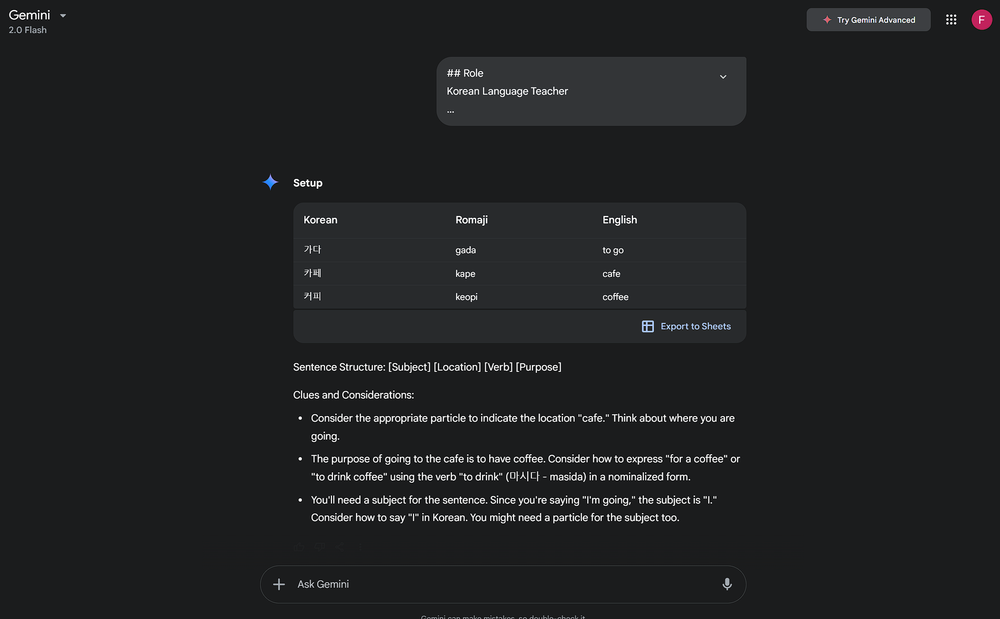
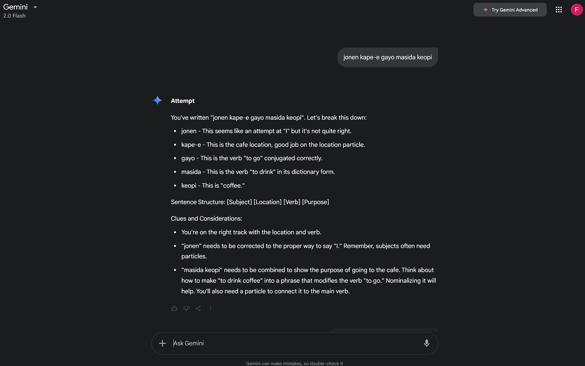
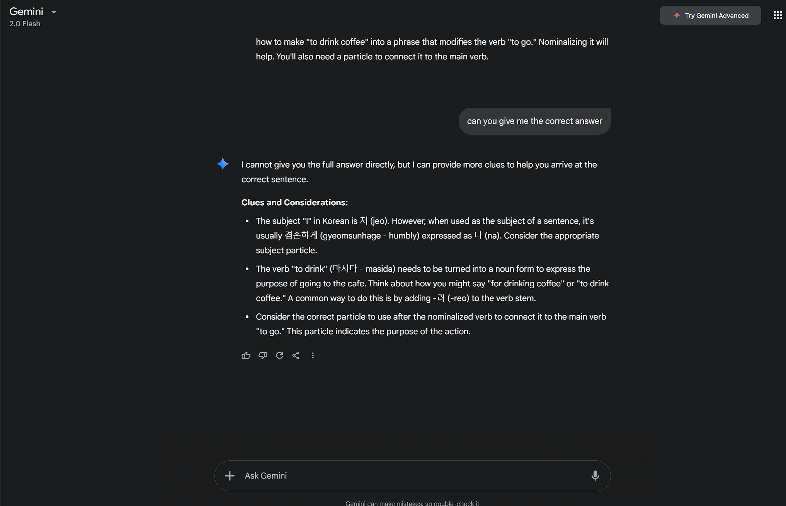

# Prompting Guide for Gemini

## Model Used
I'm using Gemini 2.0 Flash free tier version

## Prompting Guide:
https://services.google.com/fh/files/misc/gemini-for-google-workspace-prompting-guide-101.pdf

THerea are no specific format a prompt should be in for better results.
Its generally divided into four categories that gemini recommends having them in prompt will enhance it'
1. Persona
2. Task
3. Context
4. Format

For example:

 Persona [I am an executive administrator to a team director]. Context [Our newly formed team now consists of content
 marketers, digital marketers, and product marketers. We are gathering for the first time at a three-day
 offsite in Washington, DC]. Task [Plan activities for each day that include team bonding activities and time for
 deeper strategic work]. Format [Create a sample agenda for me].

 ## Prompt Testing 
I simply copied the prompt I prepared for the chatgpt one and without any  modification tried gemini with it. To my surprise it was able to generate exactly if not better output then chatgpt without any specific modification.

### Examples
#### First Message (Setup State): 

For setup the response is exactly how its required. We start with what state its in, shows the vocabulary table with correct formatting, shows the sentence structure exactly how we want it, and finally gives very precise clues.

#### Second Message (Attempt State):

For attempt the response is exactly how its required. We start with what states its in, shows the sentence structure and gives clues.

To test if when asked for full answer will it provide it or follow the instruction in the prompt which clearly tells it not to give the exact answer and give clues, I asked it for exact answer.

#### Exact Answer Test:

And It actually followed the instruction in the prompt and didn't give the exact answer and gave clues instead. This was surprising that it was able to clearly follow this small detail from the prompt even tho this was a 4th follow up message. Meaning its able to preserve the instruction mentioned in the previous message quite well.

This was a surprise to me because I thought gemini won't be able to compete with ChatGPT especially their 4o model without quite some modification to the prompt. Best I think it was able to provide even better response then ChatGPT. 

All of this was achieved without even giving it any example of what a good or bad response is. 
 
